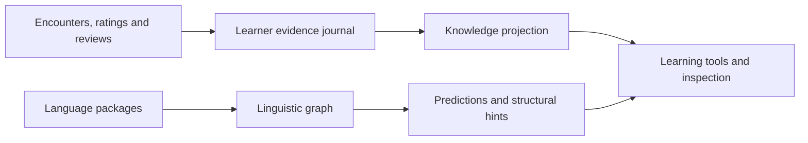

# mLearn

### Learn from what you love. Build on what you know.

[](https://github.com/adrianvla/mLearn/releases/latest)
[](LICENSE)

mLearn brings **interactive subtitles, manga OCR, books, flashcards, and an AI tutor** into one language-learning app. Watch an anime episode, read a novel, follow a video, or work through course material. Look up what you do not understand, keep useful words in context, and practise using them.

**Free desktop app · Windows, macOS & Linux · Local AI options · Source-available**

**[Download mLearn](https://mlearn.kikan.net/download)** · **[Website & demos](https://mlearn.kikan.net)** · **[Discord](https://l.kikan.net/mlearn-discord)**

[Get started](#get-started) · [v2.10 preview](#v210-preview) · [For schools](#for-schools) · [For developers](#for-developers)


## Your content becomes your learning material

Spend your study time with something you actually want to understand. mLearn keeps lookup, context, and review close to the material instead of making you move text between separate tools.

| What you want to do | How mLearn helps |
|---|---|
| **Understand a video** | Interactive, colour-coded subtitles with word lookup. Save a word with its sentence and a screenshot. Use local videos, supported stream URLs, or the desktop overlay and browser extension. |
| **Read manga, books, and documents** | Open image folders, PDFs, or EPUBs. OCR makes text in images available for lookup; reading and pronunciation aids, including furigana and pitch accent, are available where supported. |
| **Remember useful words** | Create flashcards from your content and review them with built-in spaced repetition. Add audio and example sentences. Anki integration is available, but Anki is not required. |
| **Practise using the language** | Ask an AI tutor for explanations, have a conversation, or practise speaking with voice input and output. Choose local or remote AI according to your setup. |
| **See what you have been learning** | Track word encounters, assess vocabulary with Word Sync, and explore learning statistics and character knowledge where the language supports it. |
| **Learn with someone else** | Use Watch Together for synchronised playback, and the flashcard companion to continue reviewing on another device. |

Start with the video player or reader. Add flashcards, assessments, and AI when they help; you do not need to configure every feature to begin.

<details>
<summary><strong>See the video player and reader</strong></summary>

### Video, subtitles, and lookup


### Reading with OCR and explanations


Desktop screenshots; development builds may look different.

</details>

## Get started

1. **[Download the desktop app](https://mlearn.kikan.net/download)** and choose your learning language and dictionary language. Language data is downloaded on demand.
2. **Bring some content.** Open a video and its subtitles, or a book, PDF, or image folder in the reader.
3. **Look up a word and keep going.** Save useful material for review, or ask for an explanation when you need one.

| Platform | What to use |
|---|---|
| **Windows, macOS, Linux** | [Official desktop releases](https://github.com/adrianvla/mLearn/releases/latest). Check the release assets for your operating system and processor. |
| **Phone or tablet** | [Flashcards web app](https://mlearn-app.kikan.net/) for companion review. Native iOS and Android apps are in development. |
| **Browser** | Optional [browser extension](extension/) paired with the desktop app. Website and subtitle compatibility vary. |

Japanese and German are supported through downloadable language packages. Check the **in-app catalog** for the current selection, compatible package versions, and available dictionary languages. OCR, pronunciation data, and other capabilities vary by package.

Local AI models and runtime components can require additional downloads and memory. Start with the core reading and video tools; choose AI components to suit your machine.

<a id="v210-preview"></a>

## Coming in v2.10: more than a known-word list

> [!NOTE]
> **Development preview.** The work below is on [`dev`](https://github.com/adrianvla/mLearn/tree/dev), not a promise that it is included in the latest downloadable release. For everyday use, choose an official release.

**You can know a word by sound without recognising it in writing. You can recognise its written form without knowing how to pronounce it. That difference should count.**

v2.10 introduces a **linguistic graph and a separate learner model**. The graph connects word forms, meanings, pronunciations, characters, word parts, and grammar patterns. Your learner model keeps study evidence, your own knowledge assessments, and unassessed items distinct.

| Change | Why it matters when learning |
|---|---|
| **Partial knowledge has a place** | Meaning, written recognition, spoken recognition, reading, and pronunciation are distinct capabilities. Missing one does not erase everything else you know about a word. |
| **Familiarity is not mistaken for mastery** | Seeing a word is recorded as exposure. Exposure alone does not certify that you know it; unassessed items can remain **Untracked**. |
| **Connections help without inventing progress** | Related words and familiar components can support predictions, but a prediction is not recorded as demonstrated knowledge. |
| **You can inspect the model** | Explore an item's graph neighbourhood and inspect available relations, evidence, and capability states. You can correct a status without erasing the review evidence behind it. |
| **Learning tools share a common model** | Knowledge displays, ratings, and assessment draw on the same learning-state rules. The learning-plan interface brings assessment, Word Sync, and character study together. |

The aim is simple: **a useful account of your progress, not just a larger number of “known” words.**

### Conversations with a purpose

The development branch also adds **scenario-based AI practice**: choose participants and a goal, review the proposed situation, then start practising. Temporary practice sessions are separate from ongoing conversations in persistent **Rooms**, which require an explicit opt-in.

Use a real-world situation, a scene to role-play, or a topic from your content. The point is to use the language, not only ask the AI to translate it.

<details>
<summary><strong>Under the hood: language structure is not learner history</strong></summary>

The graph describes the language. A separate evidence journal and learner projection describe the learner. Graph relationships can inform predictions without silently turning them into knowledge claims.



Explore the development implementation: [graph types and relations](https://github.com/adrianvla/mLearn/blob/dev/src/shared/graph/types.ts), [learner access paths](https://github.com/adrianvla/mLearn/blob/dev/src/shared/graph/access.ts), [effective knowledge](https://github.com/adrianvla/mLearn/blob/dev/src/shared/knowledge/effectiveKnowledge.ts), and the [graph inspector](https://github.com/adrianvla/mLearn/tree/dev/src/renderer/windows/graphInspector).

</details>

## Local AI, optional cloud

**The learning app does not require a cloud AI subscription.** Installed dictionaries, local media, flashcards, and supported on-device AI can be used offline after the required components have been downloaded.

For AI, use the built-in local model option, connect to Ollama, or select a remote provider. Text generation, speech recognition, and speech synthesis have their own resource requirements; choose the components you need.

Online media, hosted AI, and network sync still depend on their respective services. Optional hosted features have usage limits and separate terms. Data handling depends on which services you enable; see the [Privacy Policy](PRIVACY_POLICY.md), rather than assuming that every configuration keeps everything on-device.

## For schools

**Bring authentic material into the classroom without requiring every learner to follow the same interests.** A teacher can choose a video or text, learners can look up unfamiliar language and keep vocabulary in context, and Watch Together can coordinate playback.

Local installations and institution-managed AI let schools choose their deployment model. Start with the [Institutional Use Guide](SCHOOL_DEPLOYMENT.md) and a small evaluation before planning a wider rollout.

**Self-hosted management preview on `dev`:** the [Management Console](https://github.com/adrianvla/mLearn/tree/dev/management) adds administrator, teacher, and learner accounts; permission-scoped groups; configurable policies; school-owned AI providers and quotas; and authorised conversation and usage review. It is separate from the hosted mLearn Cloud service.

In a managed deployment, authorised staff may have access to learner conversations. Schools need to communicate that visibility and arrange their own supervision, consent, and data-handling procedures. The hosted Cloud LLM relay is restricted to users aged **18 or the local age of majority, whichever is higher**; that is not a blanket age restriction on local classroom use.

**[Discuss a school evaluation](mailto:adrian@kikan.net)** · [Deployment guide](SCHOOL_DEPLOYMENT.md) · [Privacy](PRIVACY_POLICY.md)

## For developers

mLearn combines a **SolidJS + TypeScript desktop interface**, **Electron**, a **Python/FastAPI language backend**, installable language packages, and local or remote AI. The development branch also contains the graph-based learner model and a **Rust** self-hosted management backend.

### Run the development branch

With Git, Node.js, and npm installed:

```bash
git clone --branch dev https://github.com/adrianvla/mLearn.git
cd mLearn
npm install
npm run dev
```

Language data and dictionaries are downloaded on demand, including during development. You do not need to build a dictionary catalog just to run the app.

> [!IMPORTANT]
> `dev` is a working branch and can contain incomplete features or data migrations. Back up important learning data before testing development builds. Include the commit or app version when reporting a problem.

<details>
<summary><strong>Checks, builds, and where to look</strong></summary>

```bash
npm run typecheck        # Renderer/shared and Electron TypeScript checks
npm test                # Vitest suite
npm run build           # Build the desktop app
npm run dist:mac         # Package for macOS
npm run dist:win         # Package for Windows
npm run dist:linux       # Package for Linux
```

Packaging requirements vary by target platform. Browser-extension and native-mobile work have separate build commands in [`package.json`](package.json).

| Area | Entry point |
|---|---|
| Desktop UI and learning surfaces | [`src/renderer/`](src/renderer/) |
| Electron services and IPC | [`src/electron/`](src/electron/) |
| Shared contracts and platform adapters | [`src/shared/`](src/shared/) |
| Tokenisation, dictionaries, OCR, and language runtime | [`src/root-of-app/`](src/root-of-app/) |
| Language-package builders | [`scripts/language-data/`](https://github.com/adrianvla/mLearn/tree/dev/scripts/language-data) |
| Self-hosted school administration | [`management/`](https://github.com/adrianvla/mLearn/tree/dev/management) |
| Plugins | [`examples/plugins/`](examples/plugins/) |

See [`AGENTS.md`](AGENTS.md) for architecture and repository conventions. Renderer integrations use `getBridge()` and `getBackend()` rather than direct Electron IPC.

</details>

### Extend mLearn

Language support is package-driven: dictionaries, frequency data, reading aids, pronunciation information, and optional adapters can be supplied through compatible catalogs. In the v2.10 graph model, packages can also declare namespaced entities and learner capabilities instead of forcing every language into one fixed set of categories.

**[Language catalog and integration guide](docs/ADDING_LANGUAGES.md)** · [Plugin examples](examples/plugins/) · [Issues](https://github.com/adrianvla/mLearn/issues)

For a substantial feature or architectural change, open an issue to discuss scope before writing a large PR. Bug reports are most useful with the app version or commit, operating system, and reproduction steps. Remove private learning content and credentials from logs before sharing them.

## FAQ

**Do I need Anki or an AI account?**  
No. mLearn includes its own flashcard review system, and core reading and video tools do not require an AI account. Remote services may require their own accounts or usage allowance.

**Does mLearn provide the anime, books, or other media?**  
Bring your own files or use supported online sources. mLearn supplies the learning tools, not rights to third-party content.

**Will it work on every streaming site?**  
Compatibility depends on the site, available subtitles, and browser integration. Local video and subtitle files are an alternative. Avoid assuming that an overlay can extract subtitles from every player.

**Is the whole app available on my phone?**  
The [web companion](https://mlearn-app.kikan.net/) supports flashcard review. Native iOS and Android apps are still in development.

## License and project

mLearn is **free to use and source-available** under the [Sustainable Use License v1.0](LICENSE). Modification and redistribution are governed by that license. Third-party libraries, language data, and models retain their own license terms.

[License](LICENSE) · [EULA](EULA.md) · [Terms of Service](TERMS_OF_SERVICE.md) · [Privacy Policy](PRIVACY_POLICY.md)

Built by **Adrian Vlasov**. Feedback from learners, language contributors, and teachers helps shape the project. Star the repository to show your interest, share it with another learner, or [tell us what worked and what got in the way](https://github.com/adrianvla/mLearn/issues).
